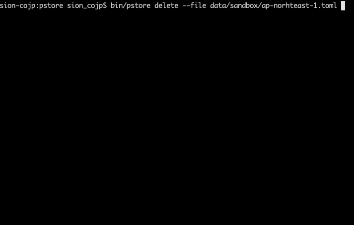

# pstore


- Manage SSM parameter store data with toml files
- Encrypt toml file

## Prepare

Manually add pstore key (32 characters: lower case alphabet + number) as "/ pstore / key"Manually add pstore key (32 characters: lower case alphabet + number) as `/pstore/key`.

(However, the path to store can be changed with `pstore-key opption`)


## Usage

```shell
### help
$ bin/pstore help
NAME:
   pstore - pstore

USAGE:
   pstore [global options] command [command options] [arguments...]

VERSION:
   0.0.0

COMMANDS:
   add       add data
   delete    delete data
   list-kms  list kms alias
   show      show decode data
   help, h   Shows a list of commands or help for one command

GLOBAL OPTIONS:
   --help, -h     show help
   --version, -v  print the version


### add
$ pstore add --file data/xxxx/ap-northeast-1.toml

### delete
$ pstore delete --file data/xxxx/ap-northeast-1.toml

### show
$ pstore show --file data/xxxx/ap-northeast-1.toml

### list-kms
$ pstore list-kms --file data/xxxx/ap-northeast-1.toml
```

## development

```shell
$ mkdir data/xxxx/
$ touch data/xxxx/ap-northeast-1.toml
$ make build
$ bin/pstore add --file data/xxxx/ap-northeast-1.toml
```

## Motivation

The parameter store contains confidential data.

With terraform, you have to encrypt with xxx-vault, but this tool was made because it is not flexible.

## License
The MIT License

Copyright Shohei Koyama / sioncojp 

Permission is hereby granted, free of charge, to any person obtaining a copy
of this software and associated documentation files (the "Software"), to deal
in the Software without restriction, including without limitation the rights
to use, copy, modify, merge, publish, distribute, sublicense, and/or sell
copies of the Software, and to permit persons to whom the Software is
furnished to do so, subject to the following conditions:

The above copyright notice and this permission notice shall be included in
all copies or substantial portions of the Software.

THE SOFTWARE IS PROVIDED "AS IS", WITHOUT WARRANTY OF ANY KIND, EXPRESS OR
IMPLIED, INCLUDING BUT NOT LIMITED TO THE WARRANTIES OF MERCHANTABILITY,
FITNESS FOR A PARTICULAR PURPOSE AND NONINFRINGEMENT. IN NO EVENT SHALL THE
AUTHORS OR COPYRIGHT HOLDERS BE LIABLE FOR ANY CLAIM, DAMAGES OR OTHER
LIABILITY, WHETHER IN AN ACTION OF CONTRACT, TORT OR OTHERWISE, ARISING FROM,
OUT OF OR IN CONNECTION WITH THE SOFTWARE OR THE USE OR OTHER DEALINGS IN
THE SOFTWARE.
